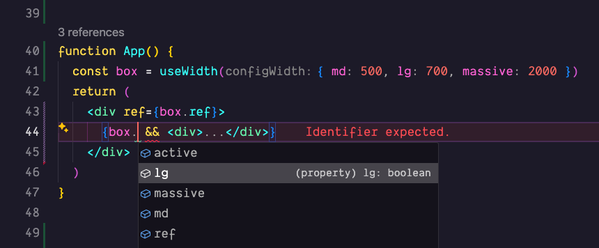

# Mezz

📐 Mezz is a set of React hooks for building responsive and adaptable web interfaces.

These hooks observe the size of elements and match the breakpoints you supply — simple, type-safe, and fast.

- 💪 Type-safe breakpoint auto-completions
- ✨ Uses the modern [ResizeObserver](https://developer.mozilla.org/en-US/docs/Web/API/ResizeObserver) browser API
- ⚡️ Customizable breakpoint naming
- 🌐 Works in all modern browsers

[👉 **View the docs**](https://mezz.benrogerson.dev/)

---

[Consider donating some 🍕 if you enjoy!](https://www.buymeacoffee.com/benrogerson)
